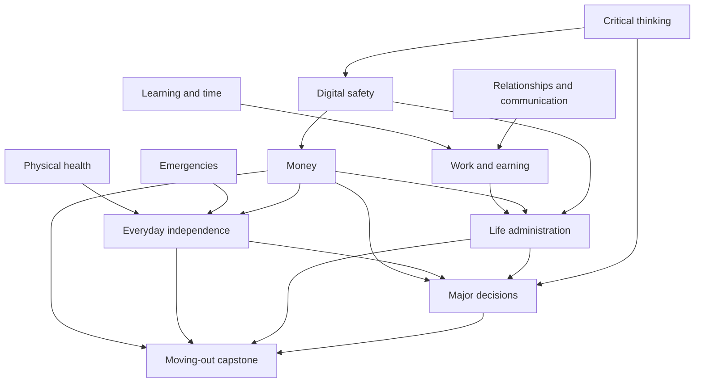

# Curriculum dependency map

[Curriculum](../README.md) · [Diagnostic](diagnostic.md) · [Pathways](../learning-plan/README.md)

These are recommended preparation skills, not enrolment barriers. Use prior evidence to skip mastered preparation, and never delay emergency or professional support. The exact stage requirements appear in the table and machine-readable index.

## Accessible map and optional branches

The diagram is an overview; this table supplies the full text equivalent, including related skills and next steps. Wellbeing is a supporting branch available at any point, not a gate before other learning.

| Domain | Recommended preparation | Related skills | Recommended next | Optional branch |
| --- | --- | --- | --- | --- |
| [Emergencies](../domains/emergencies.md) | None | [Physical health](../domains/health.md), [Everyday independence](../domains/home.md) | [Digital safety](../domains/digital-safety.md), [Everyday independence](../domains/home.md) | First-aid practical training |
| [Money](../domains/money.md) | `critical-thinking.foundation`, `digital-safety.applied` | [Work and earning](../domains/work.md), [Life administration](../domains/life-admin.md) | [Life administration](../domains/life-admin.md), [Major decisions and community](../domains/major-decisions.md) | Borrowing, insurance, investing basics |
| [Physical health](../domains/health.md) | None | [Emotional wellbeing](../domains/wellbeing.md), [Everyday independence](../domains/home.md), [Critical thinking and AI literacy](../domains/critical-thinking.md) | [Emotional wellbeing](../domains/wellbeing.md), [Everyday independence](../domains/home.md) | Accessible routines and healthcare |
| [Emotional wellbeing](../domains/wellbeing.md) | None | [Physical health](../domains/health.md), [Relationships and communication](../domains/relationships.md), [Learning and time](../domains/learning-time.md) | [Relationships and communication](../domains/relationships.md), [Learning and time](../domains/learning-time.md) | Support and problem breakdown |
| [Relationships and communication](../domains/relationships.md) | None | [Emotional wellbeing](../domains/wellbeing.md), [Work and earning](../domains/work.md) | [Work and earning](../domains/work.md), [Life administration](../domains/life-admin.md) | Professional communication |
| [Critical thinking and AI literacy](../domains/critical-thinking.md) | None | [Physical health](../domains/health.md), [Digital safety](../domains/digital-safety.md), [Major decisions and community](../domains/major-decisions.md) | [Digital safety](../domains/digital-safety.md), [Major decisions and community](../domains/major-decisions.md) | AI and media verification |
| [Digital safety](../domains/digital-safety.md) | `critical-thinking.foundation` | [Money](../domains/money.md), [Life administration](../domains/life-admin.md) | [Money](../domains/money.md), [Life administration](../domains/life-admin.md) | Recovery and privacy |
| [Everyday independence](../domains/home.md) | `emergencies.foundation`, `health.foundation`, `money.foundation` | [Life administration](../domains/life-admin.md), [Major decisions and community](../domains/major-decisions.md) | [Life administration](../domains/life-admin.md), [Major decisions and community](../domains/major-decisions.md) | Moving and utilities |
| [Work and earning](../domains/work.md) | `learning-time.applied`, `relationships.applied` | [Money](../domains/money.md), [Life administration](../domains/life-admin.md) | [Money](../domains/money.md), [Life administration](../domains/life-admin.md) | Projects and careers support |
| [Learning and time](../domains/learning-time.md) | None | [Emotional wellbeing](../domains/wellbeing.md), [Work and earning](../domains/work.md), [Life administration](../domains/life-admin.md) | [Work and earning](../domains/work.md), [Life administration](../domains/life-admin.md) | Capacity and interruptions |
| [Life administration](../domains/life-admin.md) | `money.applied`, `digital-safety.applied`, `work.foundation` | [Everyday independence](../domains/home.md), [Major decisions and community](../domains/major-decisions.md) | [Major decisions and community](../domains/major-decisions.md) | Complaints and renewals |
| [Major decisions and community](../domains/major-decisions.md) | `money.applied`, `home.applied`, `life-admin.applied`, `critical-thinking.applied` | [Work and earning](../domains/work.md), [Learning and time](../domains/learning-time.md) | Choose a capstone or reassessment. | Civic information and local services |

## How to use the map

Start with an immediate need, not necessarily guide 01. For an independent-living goal, combine money, home, administration, and major decisions; use emergencies and digital safety as support. For a work goal, begin with time and communication where those criteria are missing, then evaluate work and pay. For a suspicious payment, combine thinking, digital safety, communication, money, and records.

The [five pathways](../learning-plan/README.md) turn these connections into adaptable sessions. Competency IDs refer to the four criteria on each domain's page. [curriculum/index.json](index.json) is the structured counterpart and is checked for invalid references and prerequisite cycles.
